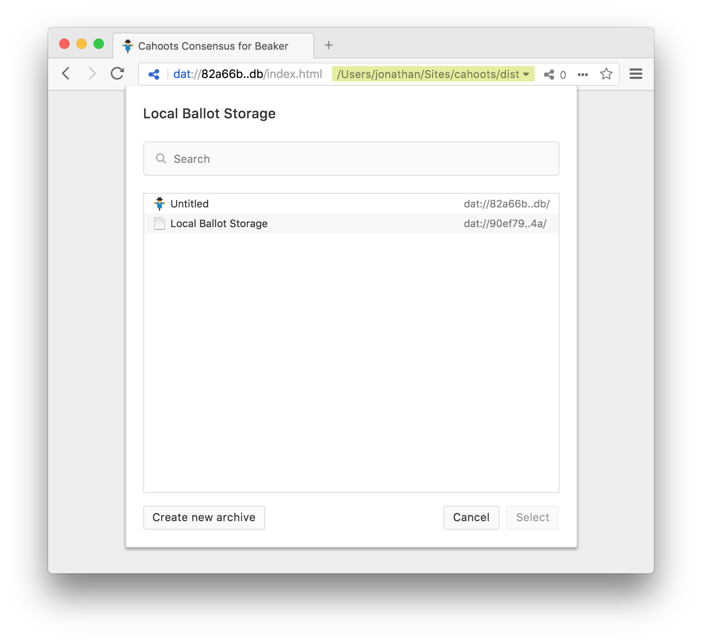
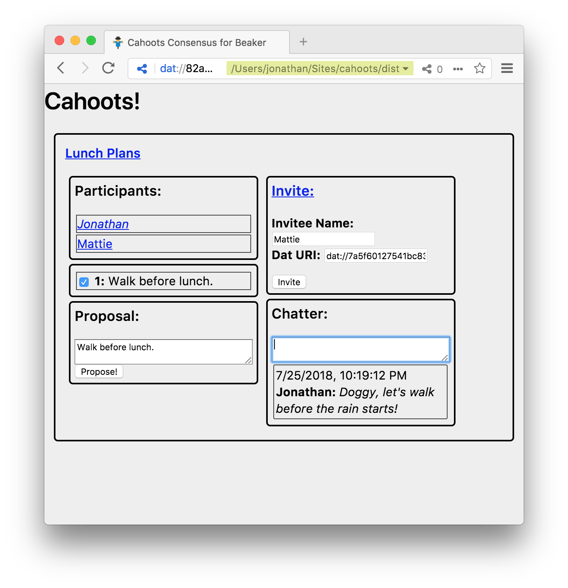

# Cahoots for Beaker
Cahoots is a single-page [Beaker](https://beakerbrowser.com/) web/[dat](https://datproject.org/) app for people to discuss and vote for the group consensus.  Just build the application and read from Beaker.

### Build/Install
```sh
npm install
npm run build
npm test
# point beaker at the dist directory
```

### Consensus
Using Cahoots for the first time, you will be prompted for a Dat archive where you will write your ballot.  Create a new archive, or select an existing one.  Your selection will be recorded in `localStorage` for the next time you visit Beaker.



Next, you should see a configuration screen providing options to create a new issue and join existing issues. 

#### Create a New Issue
To create an issue, click "New Issue", enter an title at "Issue" and your screen name at "Participant" and click "Start!"



You can post messages for the forum in the Chatter panel after pressing enter in the input area.

You can propose an idea by typing your proprosal in the Proposal panel and pressing enter.  You can support someone else's issue by selecting the checkbox.

#### Invite Voters to Your Issue
You can invite others to participate in your issue.  In the Invite panel, enter their name as you wish to see it and a Dat URL that the participant can write to (has created themselves), and click "Invite."  You'll see the new name appear in the Particpants panel with a link you can send to them.

#### Join an Existing Issue
You can view an issue, by selecting "Join Issue" on the configuration screen and paste the ballot dat:// URL, usually ending in `.json`, into the "Master ballot field", and clicking "Join!"

You can also view issues by pasting a dat:// URL of ballots into the "Ballot Directory URI" field under the "Browse Issues" configuration option.  Clicking on the title will load the view.

You cannot participate in a vote (others will not see your proposals or chat messages) until the create issue creator invites you, requiring you to send the creator a dat:// URI that you can write to.  The process is clumsy and needs work.

## Todos
- remove voter
- ballots write to server directory.... can overwrite
- voter directory -- store locally dat archive names
- running using [dat-gateway](https://github.com/pfrazee/dat-gateway)/[dat-archive-web](https://github.com/RangerMauve/dat-archive-web) returns 200. dat-archive-web needs [forked gateway](https://github.com/RangerMauve/dat-gateway)?
- DatArchive doesn't watch without polling
- handle poorly formed ballots
- tests leave open file handles
