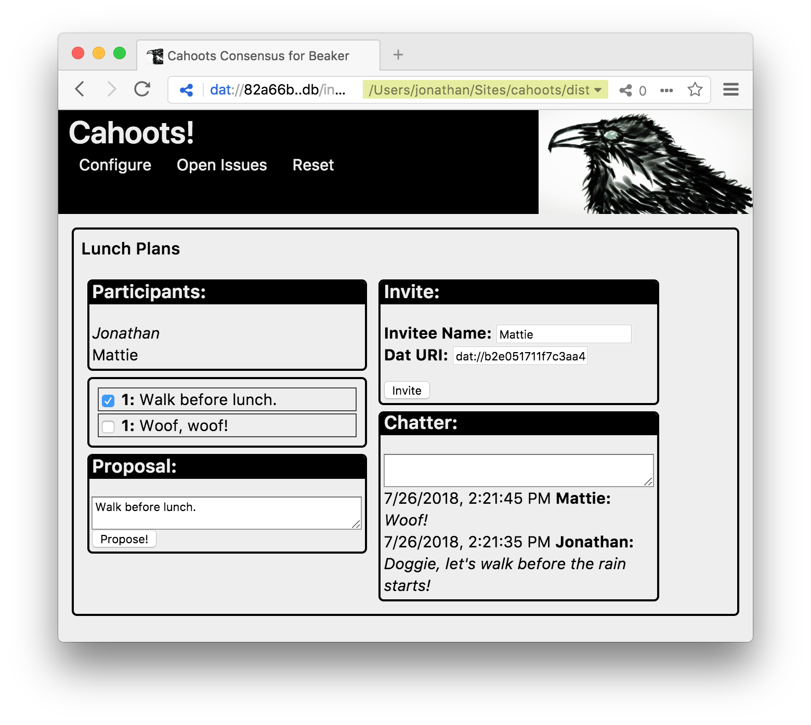

# Cahoots for Beaker
Cahoots is a single-page [Beaker](https://beakerbrowser.com/) web/[dat](https://datproject.org/) app for people to discuss and vote for the group consensus.  Just build the application and read from Beaker.

### Build/Install
```sh
npm install
npm run build
npm test!
# point beaker at the dist directory
```

### Consensus
Using Cahoots for the first time, you will be prompted for a Dat archive where you will write your ballot.  Create a new archive, or select an existing one.  Your selection will be recorded in `localStorage` for the next time you visit Beaker. [_TODO: expose the archive URL succintly and provide hook to clear it._]


Next, you should see a configuration screen providing options to create a new issue and join existing issues. [_TODO: browse issues, keep aliases to Dat ballot spaces.]


#### Create a New Issue
To create an issue, enter an title at "Issue" and your screen name at "Participant" and click "Start!"


[_TODO: return to configuration._]

You can post messages for the forum in the Chatter panel after pressing enter in the input area.

You can propose an idea by typing your proprosal in the Proposal panel and pressing enter.  You can support someone else's issue by selecting the checkbox. [_TODO: remove support from all issues._]

#### Invite Voters to Your Issue
You can invite others to participate in your issue.  In the Invite panel, enter their name as you wish to see it and a Dat URL that the participant can write to (has created themselves), and click "Invite."  You'll see the new name appear in the Particpants panel with a link you can send to them.  [_TODO: Clumsy and Beaker seems to choke on loading JS dependencies from remote Dat._]

#### Join an Existing Issue
[_TODO: browse local issues._]


## Todos
- test invitation
- test propagate messages
- figure out configuration
- browse local issues
- clear local storage....
- remove voter
- ballots write to server directory.... can overwrite
- smoother updates -- file specific watch, strategic update in UI....
- voter directory -- store locally dat archive names
- running using [dat-gateway](https://github.com/pfrazee/dat-gateway)/[dat-archive-web](https://github.com/RangerMauve/dat-archive-web) returns 200. dat-archive-web needs [forked gateway](https://github.com/RangerMauve/dat-gateway)?
- handle poorly formed ballots
- npm run watch doesn't build correctly?
- Test DAT stuff
- tests leave open file handles
